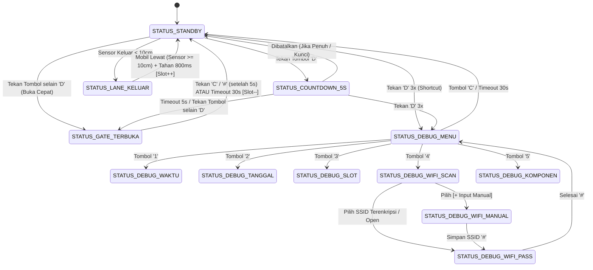

# Sistem Counter & Portal Parkir Otomatis (Dual Lane) — ESP32

Sistem penghitung dan pengatur slot parkir otomatis berbasis ESP32 DevKit C V4 dengan dua jalur terpisah (Lane Kiri untuk Masuk berportal servo SG90 berbasis tombol/tiket keypad, Lane Kanan untuk Keluar tanpa portal berbasis sensor ultrasonik HC-SR04 tunggal), UI grafis OLED 128x64 SSD1306 (I2C) dengan auto-reconnect & frame throttling cerdas, keypad matriks membran 4x4, software RTC internal POSIX, engine pengetikan teks multi-tap T9 ala ponsel klasik, pemindai & pengelola koneksi WiFi asinkron (Dual AP + STA), pemantauan diagnostik kesehatan komponen secara live (*Hardware Telemetry*), dan penyimpanan data permanen Non-Volatile Storage (NVS Flash) via library `Preferences`.

---

## 1. Arsitektur Perangkat Keras & Pemetaan Pin

Sistem dirancang efisien dengan mengoptimalkan penggunaan pin GPIO ESP32 DevKit C V4, memanfaatkan 1 sensor ultrasonik pada jalur keluar, 1 motor servo untuk portal masuk, layar OLED 0.96" I2C, dan keypad membran 4x4:

| Modul / Komponen | Pin Modul | Pin ESP32 (GPIO) | Mode / Protokol | Fungsi & Catatan |
| :--- | :--- | :--- | :--- | :--- |
| **Layar OLED 128x64** | GND | GND.2 | Power | Ground display |
| *(SSD1306 I2C)* | VCC / VIN | 3V3 | Power | Suplai logika 3.3V |
| | SCL | GPIO 22 | I2C Clock | Clock default I2C ESP32 |
| | SDA | GPIO 21 | I2C Data | Data default I2C ESP32 (Alamat: `0x3C` / fallback `0x3D`) |
| **Servo Portal SG90** | GND | GND.2 | Power | Ground motor servo |
| *(Gate Masuk)* | V+ | 5V | Power | Suplai daya 5V motor dari rail USB |
| | PWM | GPIO 4 | Output PWM | Kontrol sudut: 0° (Tutup) / 90° (Buka) via `ESP32Servo` |
| **HC-SR04 Lane Kanan** | VCC | 5V | Power | Suplai sensor 5V |
| *(Sensor Keluar / Exit)* | GND | GND.1 | Power | Ground sensor |
| | TRIG | GPIO 5 | Output Digital | Pulsa trigger ultrasonik 10 µs |
| | ECHO | Divider ke GPIO 18 | Input Pulsa | Pembagi tegangan $R_1, R_2, R_3$ (5V $\to$ 3.33V) |
| **3x Resistor 1kΩ** | $R_1$ | Antara ECHO & GPIO 18 | Pasif | Resistor seri 1kΩ dari pin ECHO |
| *(Voltage Divider)* | $R_2, R_3$ | Antara GPIO 18 & GND.1 | Pasif | Resistor seri $1\text{k}\Omega + 1\text{k}\Omega = 2\text{k}\Omega$ ke GND ($V_{out} = 5\text{V} \times \frac{2}{3} = 3.33\text{V}$) |
| **Keypad Membran 4x4** | R1 | GPIO 13 | Output Scanning | Baris 1 matriks tombol |
| *(Navigasi, Teks & Tiket)*| R2 | GPIO 12 | Output Scanning | Baris 2 matriks tombol |
| | R3 | GPIO 14 | Output Scanning | Baris 3 matriks tombol |
| | R4 | GPIO 27 | Output Scanning | Baris 4 matriks tombol |
| | C1 | GPIO 26 | Input Pull-up | Kolom 1 matriks tombol |
| | C2 | GPIO 25 | Input Pull-up | Kolom 2 matriks tombol |
| | C3 | GPIO 33 | Input Pull-up | Kolom 3 matriks tombol |
| | C4 | GPIO 32 | Input Pull-up | Kolom 4 matriks tombol |

> **Catatan Jalur Masuk (Lane Kiri):**
> Jalur masuk dirancang berbasis tiket/tombol keypad (menekan tombol apapun untuk membuka gate, atau tombol `D` dengan hitung mundur 5 detik). Sistem tidak memerlukan sensor ultrasonik kedua pada pintu masuk, sehingga menghemat konsumsi daya, pin GPIO, dan meminimalisasi interferensi cross-echo.

---

## 2. Struktur Perangkat Lunak & Modularitas Kode

Firmware disusun mengikuti arsitektur modular berorientasi domain di dalam folder `src/`:

```
TLS26-Mikon-Amber/
├── TLS26-Mikon-Amber.ino            # Orkestrator utama setup() & loop() (~140 baris)
├── concept.md                       # Spesifikasi konsep dan alur kerja sistem
├── diagram.json                     # Definisi simulasi visual dan pengkabelan Wokwi
├── wokwi.toml                       # File konfigurasi loader firmware Wokwi
├── libraries.txt                    # Dependensi library Wokwi
└── src/
    ├── config/
    │   ├── Config.h                 # Konfigurasi pinout, konstanta timing, batas slot 999, AP fallback
    │   └── SystemTypes.h            # Enum StatusSistem, InputMode, WiFiConnectionStatus, struct UIState
    ├── hardware/
    │   ├── GateServo.h/.cpp         # Driver servo SG90, deteksi beban pin PWM, buffer proteksi tegangan
    │   ├── KeypadManager.h/.cpp     # Driver scanning matriks 4x4 keypad membran
    │   └── UltrasonicManager.h/.cpp # Polling non-blocking sensor HC-SR04 Lane Keluar & timing buffer
    ├── system/
    │   ├── StorageManager.h/.cpp    # Driver persistensi NVS Flash (slot, max_slots, wifi_ssid, wifi_pass)
    │   └── TimeManager.h/.cpp       # Driver Software RTC berbasis POSIX time (struct tm, settimeofday)
    ├── input/
    │   └── KeypadInputHelper.h/.cpp # Engine pengetikan teks Multi-Tap T9 (mode ABC, abc, 123)
    ├── network/
    │   └── WiFiManager.h/.cpp       # Pengelola WiFi asinkron (Dual AP + STA, auto-connect, non-blocking scan)
    ├── ui/
    │   ├── DisplayManager.h/.cpp    # Core OLED driver SSD1306, frame throttling, dirty flag, auto-reconnect
    │   ├── UIHelper.h/.cpp          # Helper teks marquee scroll, drawHeader bergaris, drawFooter panduan
    │   ├── UIViewParking.h/.cpp     # View Standby A/B, Countdown 5s, Gate Terbuka, Lane Keluar
    │   └── UIViewDebug.h/.cpp       # View Menu, Waktu, Tanggal, Slot, WiFi Scan/Pass/Manual/Status, Komponen
    └── controller/
        ├── ParkingController.h/.cpp # FSM Operasional Parkir & Remote Manual Control methods
        └── DebugController.h/.cpp   # FSM Menu Pengaturan, validasi input, alur WiFi T9 & mute alert
```

---

## 3. Parameter Sistem & Nilai Penyimpanan Dinamis (NVS Flash)

- **Kapasitas Maksimal (`kapasitasMaksimal`)**: Default `5` slot (`DEFAULT_KAPASITAS_MAKSIMAL`), dapat dikonfigurasi dinamis hingga **999** slot (`BATAS_MAX_SLOT`) via NVS Flash (`namespace: "parking"`, `key: "max_slots"`).
- **Slot Tersedia Saat Ini (`slotTersedia`)**: Dimuat dan disimpan permanen pada NVS namespace `"parking"`, key `"slots"`.
- **Kredensial WiFi Station (STA)**: Disimpan permanen pada NVS namespace `"parking"`, key `"wifi_ssid"` dan `"wifi_pass"`.
- **Hotspot Cadangan (SoftAP Fallback)**: SSID `TLS26-Parkir` (`AP_FALLBACK_SSID`), Password `adminparkir` (`AP_FALLBACK_PASS`), IP default `192.168.4.1`.
- **Ambang Deteksi Jarak Kendaraan (`AMBANG_DETEKSI_CM`)**: `10.0 cm`.
- **Pewaktu Siklus Standby (`PERIODE_STANDBY_SCREEN`)**: `30000 ms` (30 detik).
- **Timeout Hitung Mundur Masuk (`TIMEOUT_COUNTDOWN_5S`)**: `5000 ms` (5 detik).
- **Timeout Penutupan Aman Setelah Lewat (`TIMEOUT_TUTUP_AMAN_5S`)**: `5000 ms` (5 detik).
- **Batas Maksimal Portal Terbuka (`TIMEOUT_GATE_OPEN_MAX`)**: `30000 ms` (30 detik).
- **Timeout Otomatis Menu Debug (`TIMEOUT_DEBUG_MS`)**: `30000 ms` (30 detik).
- **Jeda Multi-Tap T9 Commit (`MULTI_TAP_TIMEOUT_MS`)**: `800 ms`.
- **Batas Waktu Koneksi WiFi (`WIFI_CONNECT_TIMEOUT_MS`)**: `10000 ms` (10 detik).
- **Interval Polling Sensor Non-blocking (`INTERVAL_SENSOR_MS`)**: `60 ms`.
- **Buffer Blokir Sensor Saat Servo Bergerak (`BUFFER_SERVO_GERAK_MS`)**: `1200 ms` (1.2 detik buffer blokir sensing saat motor servo diperintahkan membuka/menutup untuk mencegah misfire akibat voltage drop).
- **Jeda Sensor Setelah Gate Ditutup (`DELAY_SENSOR_SETELAH_GATE_MS`)**: `1200 ms` (sama dengan `BUFFER_SERVO_GERAK_MS`).

---

## 4. Finite State Machine (FSM) & Detail Alur Kerja

Status sistem diatur melalui enum `StatusSistem` dengan 11 status terdefinisi:



---

### 1. `STATUS_STANDBY` (Dashboard Bersih & Slot Utama di Tengah)

Layar standby menampilkan status kuota parkir secara informatif dan elegan:
- **Area Atas ($y = 2$)**: Judul status ringkas (Size 1)
  - Standby Mode A: `"SELAMAT DATANG"`
  - Standby Mode B: `"STATUS PARKIR"`
  - Notifikasi Komponen Lepas: Jika ada komponen yang terputus dan tidak di-mute, teks berkedip antara `"SELAMAT DATANG"` dan `"-{x} Comp. Detected"` tiap 1 detik.
  - Parkir Penuh: `"! PARKIR PENUH !"`
- **Area Tengah ($y = 14\text{--}45$)**:
  - **Slot Tersedia (Normal)**:
    - Jika panjang teks slot $\le 5$ karakter (misal `5/5`, `50/50`): Font besar **Size 3** di tengah layar ($y = 18$).
    - Jika panjang teks slot $> 5$ karakter (misal `150/999`, `999/999`): Auto-scaling ke font **Size 2** di tengah layar ($y = 22$).
    - Dibingkai dua garis horizontal atas dan bawah ($y = 14$ dan $y = 45$, lebar 100 px).
  - **Parkir Penuh (`slotTersedia <= 0`)**: Teks Size 3 besar `"PENUH"` diapit garis horizontal.
- **Area Bawah ($y = 52$)**:
  - Standby Mode A: `"Tekan Tombol Utk Buka"` (teks marquee berjalan jika melebihi lebar layar).
  - Standby Mode B: Waktu real-time ringkas `Hari, HH:MM:SS` (misal `"Rabu, 12:00:00"`).
  - Parkir Penuh: `"Gerbang Dikunci"`
- **Cabang Transisi:**
  1. **Tekan Tombol 'D'**:
     - Memeriksa shortcut debug: jika ditekan 3 kali berturut-turut dalam rentang 3 detik $\to$ langsung beralih ke `STATUS_DEBUG_MENU`.
     - Jika gate terkunci darurat atau parkir penuh $\to$ permintaan ditolak.
     - Jika normal $\to$ beralih ke `STATUS_COUNTDOWN_5S`.
  2. **Tekan Tombol Selain 'D' (0–9, \*, #, A, B, C)**:
     - Jika gate tidak terkunci dan slot tersedia $\to$ langsung membuka gate seketika (**Buka Cepat**) menuju `STATUS_GATE_TERBUKA`.
  3. **Deteksi Sensor Keluar**:
     - Jika kendaraan terdeteksi pada sensor exit (`jarakKeluar < 10.0 cm`), motor servo tidak sedang bergerak, dan jeda stabilisasi pasca gerak servo telah lewat $\to$ beralih ke `STATUS_LANE_KELUAR`.

---

### 2. `STATUS_COUNTDOWN_5S` (Cooldown Antisipasi 3x 'D' / Buka Cepat)

Dipicu saat tombol `D` ditekan dari standby untuk memberikan jeda antisipasi urutan 3x `D`:
- Header: `[ PROSES MASUK ]`
- Teks: `"Membuka gate dlm:"` dan angka detik besar di tengah (`{sisaDetik}s`, Size 2 di $x = 54, y = 30$).
- Footer: `"Tekan tombol: Buka Cepat"`
- **Cabang Aksi:**
  1. **Tekan Tombol Apapun Selain D**: Langsung membuka gate seketika $\to$ `STATUS_GATE_TERBUKA`.
  2. **Pintasan Debug Mode**: Tekan `D` hingga akumulasi 3 kali berturut-turut $\to$ langsung beralih ke `STATUS_DEBUG_MENU`.
  3. **Timeout Failsafe (5 Detik)**: Gate otomatis dibuka seketika jika countdown selesai $\to$ `STATUS_GATE_TERBUKA`.

---

### 3. `STATUS_GATE_TERBUKA` (Portal Terbuka & Penutupan Aman)

- Motor servo bergerak ke sudut **90°** (terbuka). Sensor ultrasonik diberi jeda proteksi tegangan 1200 ms (`BUFFER_SERVO_GERAK_MS`).
- Header Layar: `[ PORTAL TERBUKA ]`
- Area Informasi:
  - Baris 1 ($y = 16$): `"Silakan Masuk"`
  - Baris 2 ($y = 32$): `"Timeout Gate: {sisaDetik}s"`
- Area Footer ($y = 56$):
  - Dalam 5 detik pertama ($sisaTimeoutGateMs > 25000$): `"Maju melewati gate"`
  - Setelah 5 detik ($sisaTimeoutGateMs \le 25000$): `"Tekan C: Tutup Sekarang"`
- **Cabang Penutupan:**
  1. **Tutup Cepat (Manual)**: Setelah 5 detik pertama portal dibuka, menekan tombol `C` atau `#` akan langsung menutup gate (servo 0°), sensor diberi jeda proteksi 1200 ms, kuota slot berkurang 1 (`slotTersedia--`), nilai baru disimpan ke NVS Flash, dan kembali ke `STATUS_STANDBY`.
  2. **Safety Timeout (30 Detik)**: Jika tidak ditutup manual, gate otomatis menutup setelah 30 detik (`TIMEOUT_GATE_OPEN_MAX`), kuota slot berkurang 1 (`slotTersedia--`), disimpan ke NVS Flash, dan kembali ke `STATUS_STANDBY`.

---

### 4. `STATUS_LANE_KELUAR` (Lane Keluar Sensor Tunggal Otomatis)

Dipicu saat sensor ultrasonik lane keluar mendeteksi kendaraan melintas (`jarakKeluar < 10.0 cm`):
- Header: `[ LANE KELUAR ]`
- Teks Tengah: `"SAMPAI"` (Size 2 di $x = 28, y = 18$) dan `"JUMPA!"` (Size 2 di $x = 16, y = 34$).
- Teks Bawah: Marquee horizontal halus `"Hati-hati di jalan!"` ($y = 52$).
- **Logika Penambahan Kuota:**
  - Saat mobil selesai lewat (`jarakKeluar >= 10.0 cm`): Kuota slot parkir bertambah 1 (`slotTersedia++`, dibatasi maksimal `kapasitasMaksimal`), disimpan ke NVS Flash.
  - Tampilan pesan ditahan selama 800 ms secara non-blocking agar pengemudi sempat membaca pesan, lalu sistem kembali ke `STATUS_STANDBY`.

---

### 5. `STATUS_DEBUG_MENU` (Menu Konfigurasi Operator)

Menu utama konfigurasi teknisi:
- Header: `--- DEBUG MODE ---`
- Pilihan Menu:
  - `1:Waktu    2:Tanggal` $\to$ `STATUS_DEBUG_WAKTU` / `STATUS_DEBUG_TANGGAL`
  - `3:Slot     4:WiFi` $\to$ `STATUS_DEBUG_SLOT` / `STATUS_DEBUG_WIFI_SCAN`
  - `5:Status Komponen` $\to$ `STATUS_DEBUG_KOMPONEN` (Live telemetri peranti tiap 1 detik)
  - `6:Mute Notif: [ON]/[OFF]` $\to$ Toggle pembungkaman kedipan notifikasi komponen lepas pada standby (sementara hingga power reset / volatile)
  - `C:Keluar ke Standby` $\to$ Kembali ke `STATUS_STANDBY`
- **Auto Timeout 30 Detik**: Keluar otomatis ke `STATUS_STANDBY` jika tidak ada tombol ditekan selama 30 detik (`TIMEOUT_DEBUG_MS`).

---

### 6. `STATUS_DEBUG_WAKTU` (Sub-Menu Jam Real-Time 24H)

- Header: `[ SET WAKTU 24H ]`
- Menampilkan:
  - `Jam skrg: HH:MM:SS`
  - `Format  : HHMMSS`
  - `Input: [HH:MM:SS]` dengan format dinamis (`_` placeholder dan pemisah `:` otomatis).
- Tombol:
  - `0–9`: Input digit jam, menit, dan detik (hingga 6 digit).
  - `*`: Backspace (hapus digit terakhir).
  - `#`: Simpan dan validasi. Mendukung input 6 digit (`HHMMSS`) maupun 4 digit fallback cerdas (`HHMM`, detik otomatis diisi 00). Validasi Jam 00–23, Menit 00–59, Detik 00–59. Feedback `"Waktu Disimpan!"` atau `"Waktu Invalid!"` ditampilkan selama 2 detik sebelum kembali ke menu.
  - `C`: Batal dan kembali ke menu utama debug.

---

### 7. `STATUS_DEBUG_TANGGAL` (Sub-Menu Tanggal)

- Header: `[ SET TANGGAL ]`
- Menampilkan:
  - `Tgl skrg: DD/MM/YYYY`
  - `Format  : DDMMYYYY`
  - `Input: [DDMMYYYY]` dengan placeholder `_` hingga 8 digit.
- Tombol:
  - `0–9`: Input digit (hingga 8 digit).
  - `*`: Backspace.
  - `#`: Simpan dan validasi. Validasi Tanggal 1–31, Bulan 1–12, Tahun 2000–2099. Feedback `"Tanggal Disimpan!"` atau `"Tanggal Invalid!"` selama 2 detik sebelum kembali ke menu.
  - `C`: Batal dan kembali ke menu utama debug.

---

### 8. `STATUS_DEBUG_SLOT` (Sub-Menu Edit Slot Parkir Terpadu hingga 999)

- Menampilkan nilai tersimpan saat ini (*previous value*) berdampingan dengan nilai baru yang sedang diketik:
  ```
  [ ATUR SLOT PARKIR ]
  --------------------
  >Slot: 4 -> [ 6 ]
   Maks: 5 -> [ 10]
  A:Pilih Field  *:Del
  #:Simpan     C:Batal
  ```
- Tombol:
  - `A`: Pindah fokus kursor antara `Slot` (Tersedia) dan `Maks` (Kapasitas Maksimal).
  - `0–9`: Input angka hingga 3 digit (maksimal 999).
  - `*`: Backspace pada field yang sedang aktif.
  - `#`: Simpan validasi ($1 \le \text{Max} \le 999$ dan $0 \le \text{Slot} \le \text{Max}$). Jika field dibiarkan kosong, nilai lama dipertahankan. Data disimpan permanen ke NVS Flash. Feedback `"Slot Disimpan!"` atau `"Nilai Invalid!"` selama 2 detik.
  - `C`: Batal dan kembali ke menu utama debug.

---

### 9. `STATUS_DEBUG_WIFI_SCAN` (Pemindaian WiFi Asinkron & Scrollable List)

- Menggunakan pemindaian asinkron non-blocking `WiFi.scanNetworks(true, false)`.
- Menampilkan status `"Memindai WiFi..."` saat proses pemindaian berjalan.
- Menampilkan daftar SSID yang dapat di-scroll (3 baris per layar) dengan header `[ WIFI x/y (A/B) ]`:
  - Item 0 (paling atas): `[+ Input Manual]` (untuk menghubungkan ke SSID tersembunyi / manual).
  - Item 1..n: Nama `SSID` (disingkat 13 karakter + `~` jika terlalu panjang), disertai tanda `*` jika terenkripsi.
- Tombol:
  - `A`: Scroll ke atas.
  - `B`: Scroll ke bawah.
  - `*`: Pindai ulang (*Rescan*).
  - `#`: Pilih item.
    - Jika item 0 dipilih $\to$ beralih ke `STATUS_DEBUG_WIFI_MANUAL`.
    - Jika open network (tanpa password) $\to$ langsung menghubungkan dan membuka layar status koneksi.
    - Jika terenkripsi $\to$ membuka form input password `STATUS_DEBUG_WIFI_PASS`.
  - `C`: Batal dan kembali ke menu utama debug.

---

### 10. `STATUS_DEBUG_WIFI_PASS` & `STATUS_DEBUG_WIFI_MANUAL` (Input Teks Multi-Tap T9)

Engine pengetikan `KeypadInputHelper` mengadopsi mekanisme keypad ponsel klasik:

| Tombol | Karakter Multi-Tap Mode `[ABC]` | Karakter Multi-Tap Mode `[abc]` | Mode `[123]` |
| :---: | :--- | :--- | :---: |
| **0** | ` ` (spasi), `0` | ` ` (spasi), `0` | `0` |
| **1** | `.`, `,`, `?`, `!`, `@`, `-`, `_`, `/`, `1` | `.`, `,`, `?`, `!`, `@`, `-`, `_`, `/`, `1` | `1` |
| **2** | `A`, `B`, `C`, `2` | `a`, `b`, `c`, `2` | `2` |
| **3** | `D`, `E`, `F`, `3` | `d`, `e`, `f`, `3` | `3` |
| **4** | `G`, `H`, `I`, `4` | `g`, `h`, `i`, `4` | `4` |
| **5** | `J`, `K`, `L`, `5` | `j`, `k`, `l`, `5` | `5` |
| **6** | `M`, `N`, `O`, `6` | `m`, `n`, `o`, `6` | `6` |
| **7** | `P`, `Q`, `R`, `S`, `7` | `p`, `q`, `r`, `s`, `7` | `7` |
| **8** | `T`, `U`, `V`, `8` | `t`, `u`, `v`, `8` | `8` |
| **9** | `W`, `X`, `Y`, `Z`, `9` | `w`, `x`, `y`, `z`, `9` | `9` |

- **Kontrol Tombol Tambahan:**
  - `D`: Beralih mode input (`[ABC]` $\to$ `[abc]` $\to$ `[123]`).
  - `*`: Backspace (menghapus karakter pending atau karakter terakhir).
  - `B`: Spasi cepat (*Quick Space*).
  - `A`: Commit karakter pending seketika.
  - `#`: Selesai / Submit / Hubungkan.
  - `C`: Batal dan kembali ke daftar WiFi.
  - Jeda Commit Otomatis: `800 ms` (`MULTI_TAP_TIMEOUT_MS`).

- **Alur Layar Status Koneksi (`STATUS_DEBUG_WIFI_PASS`):**
  - **Sedang Menghubungkan (`WIFI_STATUS_CONNECTING`)**: Menampilkan target SSID dan `"Mohon tunggu..."`. Tekan `C` untuk membatalkan koneksi.
  - **Berhasil Terhubung (`WIFI_STATUS_CONNECTED`)**: Menampilkan `"WIFI TERHUBUNG!"`, IP Address Station yang diperoleh (misal `192.168.1.50`), dan `"Tersimpan di Flash"`. Kredensial otomatis disimpan ke NVS Flash untuk auto-connect saat boot berikutnya. Tekan `#` untuk selesai dan kembali ke menu debug.
  - **Gagal Terhubung (`WIFI_STATUS_FAILED`)**: Menampilkan `"KONEKSI GAGAL!"` dan `"Periksa Password / Jangkauan Sinyal"`. Tekan `*` untuk mencoba lagi dengan password yang sama, atau `C` untuk kembali ke daftar scan.

---

### 11. `STATUS_DEBUG_KOMPONEN` (Diagnostik Status Komponen Hardware Live)

Menampilkan status kesehatan dan telemetri langsung 5 elemen peranti keras:
```
[ STATUS KOMPONEN ]
--------------------
OLED  : OK (0x3C)
US-EXIT: OK (185cm)
MASUK : KEYPAD TIKET
SERVO : OK (0 deg)
KEYPAD: OK  [C:Menu]
```
- **Mekanisme Deteksi Perangkat Keras:**
  1. **Layar OLED SSD1306**: Dipantau melalui I2C probe (`Wire.beginTransmission`). Jika kabel OLED terlepas, layar ditandai `MISSING` dan sistem otomatis mencoba auto-reconnect setiap 2 detik di latar belakang tanpa memblokir sistem.
  2. **Sensor Ultrasonik Keluar (HC-SR04)**: Diuji integritas pulsa echo-nya. Jika echo pin tidak merespon pulsa trigger dalam 1500 µs, sensor dinyatakan `MISSING`.
  3. **Alur Masuk**: Menegaskan arsitektur operasional masuk berbasis penekanan keypad tiket.
  4. **Motor Servo SG90**: Dideteksi koneksi fisiknya secara cerdas via pengujian pelepasan muatan pin PWM (*discharge latency*) dan pembacaan ADC impedansi beban (`analogRead`). Menampilkan sudut terkini (0° / 90°).
  5. **Keypad Membran 4x4**: Status operasional matriks keypad.
- **Peringatan Komponen Terlepas (*Missing Component Alert*):**
  - Jika terdapat komponen yang terlepas/hilang (`missingComponentCount > 0`):
    - Header layar standby default akan berkedip antara `"SELAMAT DATANG"` dan `"-{x} Comp. Detected"` tiap 1 detik.
    - Opsi `6: Mute Notif` di menu debug dapat digunakan untuk membungkam notifikasi kedipan ini sementara (*volatile until power reset*).
- Tombol `C`: Kembali ke Menu Utama Debug.

---

## 5. Optimasi Efisiensi Pemrosesan

1. **OLED Frame Throttling & Smart Dirty Flag**:
   - Bus I2C mentransfer buffer frame hanya jika ada perubahan status/input (`isDirty`), saat jam berganti (500 ms), atau saat marquee scrolling / animasi aktif (dibatasi 33–35 ms / ~30 FPS).
   - Menghindari pengiriman data I2C berlebih, memangkas beban CPU ESP32 hingga >80% dan menjaga responsivitas eksekusi FSM.
2. **Buffer Blokir Sensor Saat Servo Bergerak**:
   - Menghilangkan pembacaan palsu (*misfire*) sensor ultrasonik akibat fluktuasi penurunan tegangan (*voltage sag*) saat motor servo SG90 mulai bergerak.
   - Sistem mengaktifkan jeda buffer 1200 ms (`BUFFER_SERVO_GERAK_MS` / `DELAY_SENSOR_SETELAH_GATE_MS`) saat gerbang dibuka maupun ditutup, di mana sensor mengembalikan nilai aman 999.0 cm.
3. **Asynchronous WiFi Scanning & Non-Blocking State Machine**:
   - Pemindaian WiFi menggunakan `WiFi.scanNetworks(true, false)` yang berjalan di latar belakang tanpa fungsi `delay()` yang membekukan pembacaan tombol keypad atau polling sensor.
4. **Software RTC Internal POSIX**:
   - Menggunakan fungsi POSIX standar C library (`settimeofday()`, `localtime()`, `struct tm`), menyediakan pelacakan waktu nyata (jam, menit, detik, tanggal, dan nama hari bahasa Indonesia) tanpa memerlukan modul hardware RTC eksternal seperti DS3231.
5. **NVS Flash Endurance Protection**:
   - Menggunakan library `Preferences` dengan pengecekan nilai lama terlebih dahulu (`prefs.getInt()` / `prefs.getString()`). Penulisan ke flash memory ESP32 hanya dilakukan jika terjadi perubahan nilai nyata, sehingga menjaga keawetan chip flash hingga ratusan ribu siklus.

---

## 6. Arsitektur Standalone & Konektivitas WiFi

Sistem beroperasi mandiri (*standalone*) menggunakan layar OLED 0.96", Keypad membran 4x4, motor servo SG90, dan sensor ultrasonik HC-SR04 Lane Keluar. 

- **WiFi Dual-Mode (`WIFI_AP_STA`)**:
  - **Station (STA)**: Memindai jaringan WiFi lokal, memasukkan password via T9 di layar OLED, dan menghubungkan perangkat ke router lokal dengan persistensi NVS Flash.
  - **SoftAP Fallback**: Menyediakan Access Point cadangan dengan SSID `TLS26-Parkir`, password `adminparkir`, dan IP `192.168.4.1`.
- **Peniadaan Web Server / Dashboard**:
  - Web Server, WebSocket Server, dan Web Dashboard PWA bawaan telah dinonaktifkan dan dihapus dari firmware untuk memaksimalkan efisiensi memori Flash dan RAM pada ESP32, memastikan seluruh sumber daya prosesor dialokasikan secara deterministik untuk stabilitas pembacaan sensor dan UI perangkat keras.